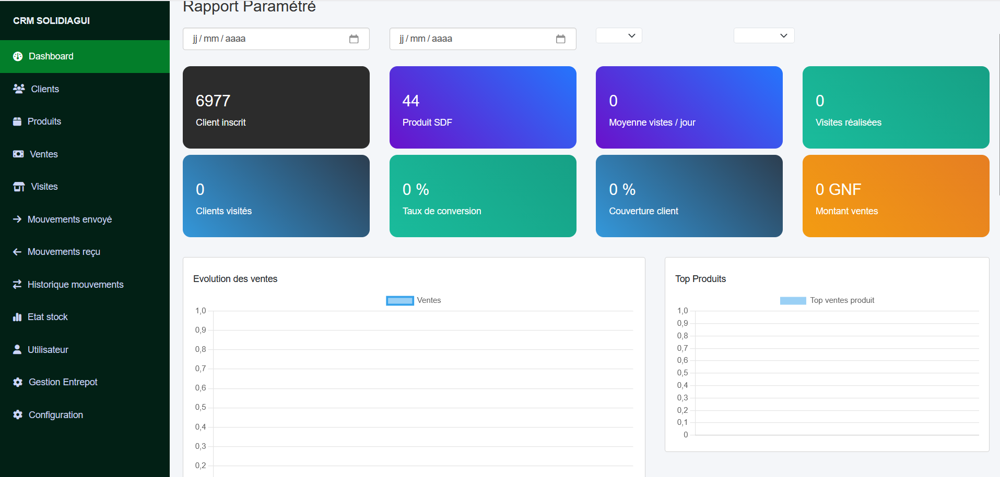
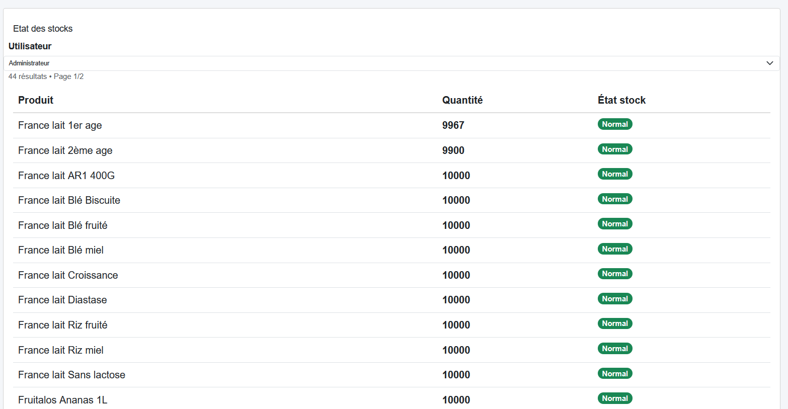
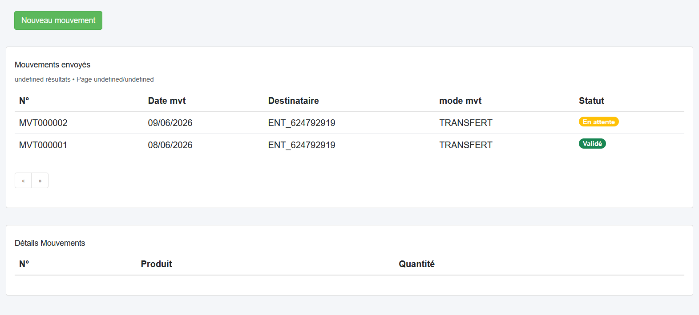
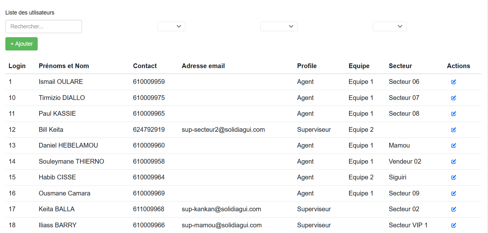

# CRM-SaaS – Gestion des Stocks et des Flux Logistiques

Application web développée avec **Django** permettant de gérer les stocks, les mouvements de marchandises, les utilisateurs et les entrepôts.

## Présentation

Ce projet a été conçu afin de digitaliser la gestion des stocks d'une entreprise. Il permet un suivi fiable des entrées, sorties et transferts de produits, avec une gestion des droits d'accès selon les profils utilisateurs.

Le projet est actuellement en évolution avec l'ajout d'une API REST destinée à une future application mobile.

---

## Fonctionnalités

### Authentification

- Connexion par email
- Mot de passe sécurisé (hash Django)
- Gestion des rôles
- Permissions selon le profil

### Gestion des utilisateurs

- Création
- Modification
- Désactivation

### Gestion des entrepôts

- Création
- Modification
- Suppression

### Gestion des produits

- Référencement
- Catégorisation
- Stock minimum

### Gestion des mouvements

- Entrée de stock
- Sortie de stock
- Historique des mouvements

### Gestion du stock

- Calcul automatique des quantités
- États des stocks
- Alertes visuelles

### API REST

- Authentification
- Consultation des stocks
- Synchronisation avec une application mobile

## Éco-conception

Ce projet applique plusieurs bonnes pratiques visant à limiter l'impact environnemental :

- Pagination des listes pour limiter les données transférées.
- Optimisation des requêtes SQL.
- Chargement asynchrone (AJAX) des données.
- Réutilisation des composants de l'interface.
- Gestion optimisée des fichiers statiques.

---

## Technologies

### Backend

- Python
- Django
- Django REST Framework
- MySQL

### Frontend

- HTML5
- CSS3
- Bootstrap
- JavaScript
- AJAX

### Outils

- Git
- GitHub
- Visual Studio Code

---

## Captures d'écran

### Tableau de bord



### Gestion des stocks



### Gestion des mouvements



### Gestion des utilisateurs



---

## Installation

```bash
git clone https://github.com/tontonbill89/CRM-Saas.git

cd CRM-Saas

python -m venv envsdf
```

### Windows

```bash
envsdf\Scripts\activate
```

Installer les dépendances

```bash
pip install -r requirements.txt
```

Appliquer les migrations

```bash
python manage.py migrate
```

Lancer le serveur

```bash
python manage.py runserver
```

---

## Sécurité

- Authentification Django
- Protection CSRF
- Permissions par rôle
- Gestion des erreurs personnalisées
- Mots de passe hashés

---

## Améliorations prévues

- Tableau de bord analytique
- Notifications
- Scan de codes-barres / QR Codes
- Génération PDF
- Export Excel
- Inventaire mobile
- Synchronisation hors ligne

---

## Auteur

**Moussa Bill Keita**

Projet réalisé dans le cadre de mon apprentissage du développement Full Stack avec Django.